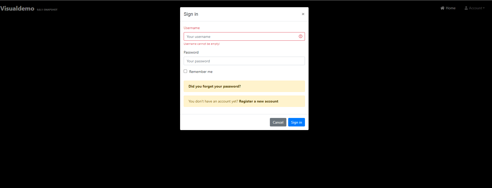
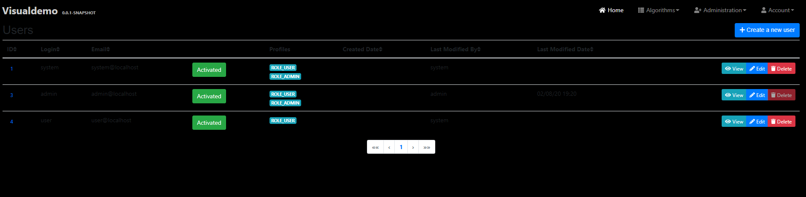
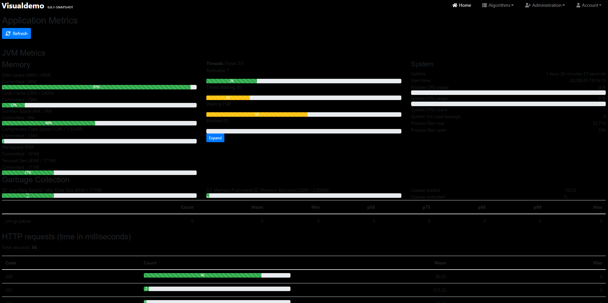
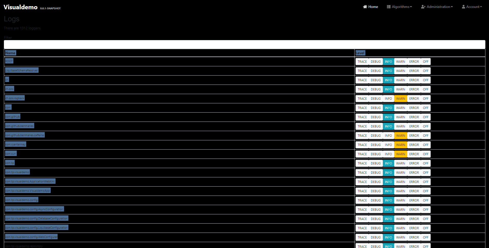
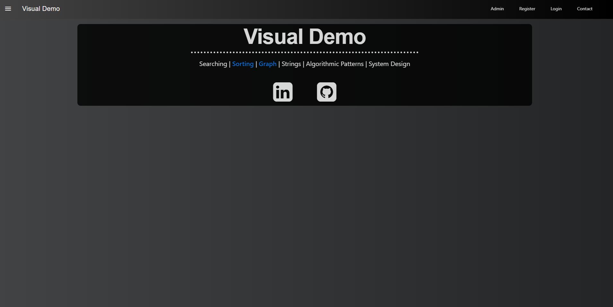
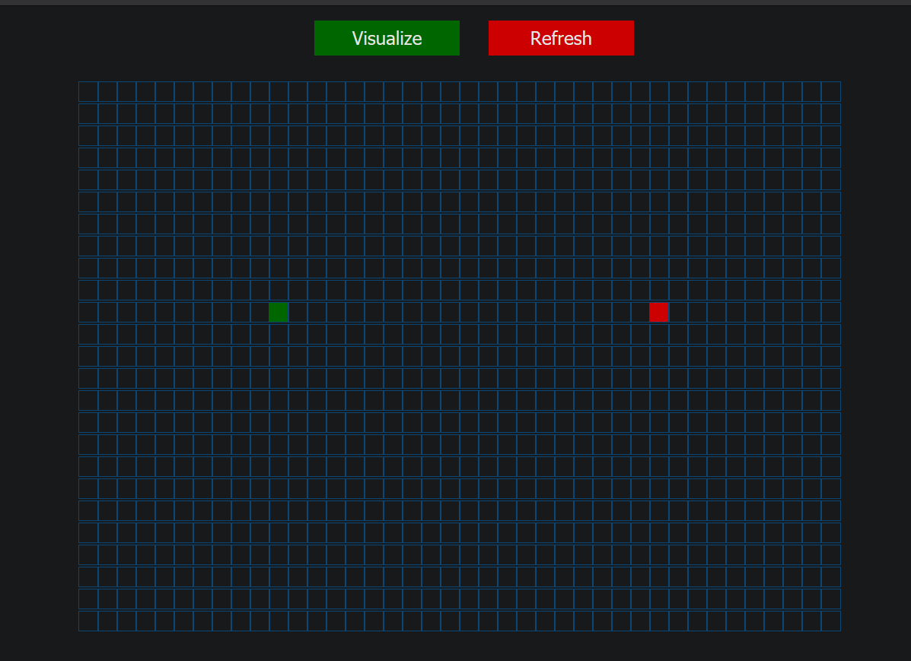

# Visual Demo

This will be a web application for the purposes of demonstrating software engineering skillset and learning modern technologies and techniques.
The main function of the application will be to create visualizations of common algorithms and functions.

[Project Plan](ProjectPlan.md)\
[Roadmap](https://trello.com/b/VTMX8l4A)

## Current Version
Using a rapid deployment tool, we were able to gain great insight into full stack development processes and tools. This version may serve as a framework to build our app on.

The current project can be found at http://visualdemo-1-env.eba-myk4weza.us-west-2.elasticbeanstalk.com/

- Used JHipster full stack development platform to build:
    - Monolithic architecture
    
    - Client-side:
        - React as client side framework with Redux
        - Bootstrap
        - Sass / CSS
        - Typescript with webpack
        - JSX with babel
        - NPM
        - Jest and Protractor for testing
    - Server-side:
        - Spring Boot for application configuration
        - Maven configuration for building, testing and running the application
        - "development" and "production" profiles
        - Spring Security
        - Spring MVC REST
        - Spring Data JPA
        - Liquibase for database updates
        - JWT for authentication
        - SQL database
        - H2 as development database
        - PostgreSQL as production database
        - Caffeine for local cache
        - Hibernate for 2nd level cache
        - Connection pooling with HikariCP

- Deployed onto AWS EC2 using Elastic Beanstalk
- Set up Continuous Integration using Jenkins CI/CD pipeline

## Previous Version
The project is still in a Proof Of Concept Prototype stage and is not versioned:
Current version can be found here: https://park-jsdev.github.io/my-app/

## Next Action
- Add more algorithm features.

## Previous
- Added JHipster framework and deployed to cloud environment
- Set up CI/CD using Jenkins pipeline

- Created graph algorithm visualizer prototype, one of the functionalities of the project

